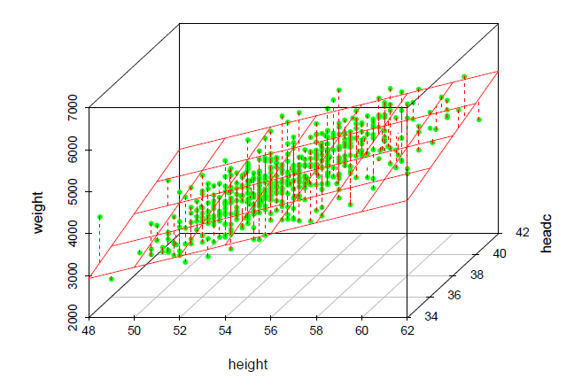
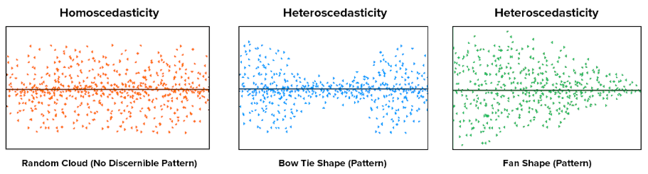

# Multiple Linear regression {#sec-multiplelinear}

```{r}
#| include: false

library(fontawesome)

library(kableExtra)
```

::: {.callout-tip appearance="simple"}
## Get the Code

You can download the complete R script from here:

<a href="https://osf.io/download/tyq9s/" download="psy400_7.R"> <button type="button" class="btn btn-primary"> <i class="bi bi-download"></i> Download R Script </button> </a>
:::


**DATA:** We will work with the **birthweight** dataset that we downloaded in the previous lesson.


<br>

First, we load the following R packages in our R session:

```{r}
#| warning: false 

# Required packages for this R script
library(car)
library(performance)
library(interactions)
library(tidyverse)
library(ggstatsplot)
library(readxl)
```

 

## Multiple linear regression model

Although multivariable regression may appear complex, its concepts, computations, and interpretations are direct extensions of those in simple regression.

The general form of a linear regression model is given by:

$$\widehat{y} = b_o  + b_1 \cdot x_1 + b_2 \cdot x_2 + b_3 \cdot x_3 + ...+b_p \cdot x_p$$ {#eq-line21}

The objective is to obtain the coefficients-also known as partial regression slopes- $b_o, b_1, b_2, b_3,...,b_p$.

It is important to emphasize that the term “linear” refers to the model’s linearity in the coefficients b, rather than in the explanatory variables x. For example, the following is still considered a **general** linear model:

$$\widehat{y} = b_o  + b_1 \cdot x_1 + b_2 \cdot x_2 + b_3 \cdot x_1 \cdot x_2 + b_4 \cdot x_1^2$$ {#eq-line22}

For example, in @fig-linear3d we present a model consisted of one response variable (weight) and two continuous explanatory variables (height, headc):

$$
\begin{aligned}
\widehat{\text{y}} &= b_o + b_1 \cdot x_1 + b_2 \cdot x_2\\
\widehat{\text{weight}} &= b_o + b_1 \cdot \text{height} + b_2 \cdot \text{headc}
\end{aligned}
$$

{#fig-linear3d width="75%"}

We have visualized some of the points as being located above the plane and some as being located below the plane. The deviation of a point from the plane is represented by the dashed red line and is the residual. When the model contains more than two independent variables, it is described geometrically as a hyperplane.

It is important to note that the residuals in linear regression are assumed to be independent and identically distributed following the normal distribution with mean equals to zero and constant variance.

## Basic criteria for model selection

In simple linear regression, there is only one possible model, as it involves a single explanatory variable. However, in multiple linear regression, where multiple explanatory variables are involved, the challenge becomes identifying the best model. But what does “best” really mean?

Should we select a model with only a few explanatory variables, or include as many as possible? For instance, if we have 20 potential explanatory variables, should we use all of them—or just a subset? And if we choose to use a subset, how do we decide which variables to include in order to optimize a particular function or goal?

Surprisingly, these questions do not have straightforward answers—even for experienced researchers and data analysts. Variable selection in regression modeling is a complex task, and there is no universal agreement on the best approach. As we’ll see, choosing the “best” model often depends as much on scientific or practical considerations as on statistical criteria.

A fundamental principle in model selection is the preference for **simplicity**. When comparing two models that explain the data equally well, the simpler model is generally favored. This principle, known as Occam’s Razor (or the law of parsimony), is widely embraced across scientific disciplines, including statistics.

> **Parcimonious model:** We typically prefer simpler models, provided they account for similar amounts of variance as more complex ones.

The idea behind a parsimonious model is to avoid overfitting, where a model becomes too complex and starts to capture noise rather than the underlying patterns in the data. A parsimonious model aims to find a balance between complexity and performance, ensuring that the model is neither too simple (underfitting) nor too complex (overfitting).

## Strategies for model selection

Next we present some commonly used strategies for model selection:

-   **Simultaneous Regression**

The first and most straightforward approach to model selection is to include all available explanatory variables and assess model fit based on this complete model. This is known as full entry or simultaneous regression. In this method, the regression model is built by estimating all parameters simultaneously. However, there are cases where full-entry or simultaneous regression may not be the best choice for model-building. In such instances, the researcher may prefer to adopt a more complex algorithm for constructing the regression model.

-   **Hierarchical Regression**

In hierarchical regression, unlike in simultaneous regression, where all explanatory variables are entered into the model at once, researchers typically follow a pre-specified order for introducing variables creating multiple models or blocks. The order is usually driven by theory, reflecting the researcher’s prior knowledge. Hierarchical regression is particularly popular among social scientists when testing mediational hypotheses.

-   **Automated regression methods (Best subset selection)**

These methods combine the explanatory variables in all possible ways. The best subset selection (using backward elimination, forward selection, or both \[stepwise selection\]) seek to find the best model according to statistical criteria in many steps (stepwise method, the model is re-avaluated in each step). However, as you might imagine, the number of possible models quickly becomes quite large.

It is important to note that several statistical criteria can be used to assess the efficiency or fit of a model, with penalties for the number of explanatory variables. These criteria are calculated and compared across a set of competing models, providing an objective basis for selecting the "best" regression model. Examples include adjusted R-squared, Akaike Information Criterion (AIC)—where a smaller AIC indicates a better model—and Bayesian Information Criterion (BIC).

At first glance, especially for those new to statistics, automated selection methods may seem like an ideal solution for many multiple regression problems. They can appear to be the “panacea” for model selection—after all, allowing the computer to determine the “correct” model using its complex computational abilities seems like a logical approach.

However, the issue is not as straightforward as it may seem, and several statistical and substantive challenges complicate the application of these methods. While automation offers convenience, it also has significant drawbacks, and not all decisions can or should be left to a computer. In addition to these statistical issues, there are substantive considerations to account for when selecting a model. The final model chosen by automated methods may not always offer the most practical value or utility.

From a statistical perspective, automated selection methods, such as forward and backward regression, can introduce bias into parameter estimates, making the resulting inferential model unreliable. After multiple iterations, the probability of a Type I error becomes higher than the nominal $\alpha$ (typically 0.05). In addition to these statistical issues, there are substantive considerations to account for when selecting a model. The final model chosen by automated methods may not always offer the most practical value or utility.

> **Maximizing statistical criteria is not the same as maximizing utility of the model.**

-   **Purposeful selection process**

The purposeful selection process begins with a univariable analysis of each candidate variable. A general decision rule is then applied to determine which variables to include. For example, any variable with a p-value \< 0.20 in the univariable analysis may be selected for the multivariable analysis.

However, since the primary goal of a multivariable model is typically to assess the effect of the study intervention while controlling for potential confounders, variable selection should also take into account existing knowledge and the clinical significance of the variables. If necessary, the initial rule can be adjusted. For example, a potential confounder may be included in the model if it alters the coefficient of the primary exposure variable by 10% in the multivariable model.

 

## Importing data

Continuing from the previous chapter, we will work with the *birthweight* dataset. This time, we aim to explore the association between infant weight and all other measured explanatory variables.

```{r}
#| warning: false 

dat <- read_excel("data/birthweight.xlsx")
dat
```

• Body weight of the infant in g (weight)

• Body height of the infant in cm (height)

• Head circumference in cm (headc)

• Gender of the infant (gender: Female, Male)

• Birth order in their family (parity: Singleton, One sibling, 2 or more siblings)

• Education of the mother (education: tertiary, year10, year12)

 

We convert `gender`, `parity`, and `education` into factor variables:

```{r}
dat <- dat |> 
  mutate(gender = factor(gender),
         parity = factor(parity,
                         levels = c("Singleton", "One sibling", "2 or more siblings")),
         education = factor(education,
                            levels = c("year10", "year12", "tertiary")))

dat
```

## Simultaneous Regression

First, we will include all available explanatory variables and assess model fit based on this complete model.

```{r}
model_full <- lm(weight ~ ., data = dat)
```

**NOTE:** The dot (`.`) tells R to include all explanatory variables present in the data frame.

### Assumptions

Specific assumptions have to be met for reliable hypothesis testing and confidence intervals in linear regression: independence of the residuals, linearity and homoscedasticity of the data, normality of the residuals, no multicollinearity and outliers. We will describe some statistical tests and diagnostic plots in R for testing the assumptions underlying linear regression model.

**Independence of residuals**

The residuals (or errors) from the model should be independent of each other. If the sample is obtained through random sampling at a single time point, independence can generally be assumed.

 

**Linearity of the data**

In a multiple regression model, Component+Residual (C+R) plots (or partial residual plots) serve as a diagnostic tool to visualize how a single explanatory variable influences the outcome (`weight`) after accounting for the other explanatory variables in the model.

```{r}
#| fig-height: 14
#| fig-width: 8

crPlots(model_full, smooth = FALSE)
```

For a continuous explanatory variable, the points in a C+R plot represent the variable’s partial association with the response variable after adjusting for all other explanatory variables. If these points align reasonably well with the fitted straight line (that is, the slope estimated by the regression model), then the assumption of a linear effect for that variable is supported. Systematic curvature or other visible patterns may indicate non-linearity and suggest the need for transformations or additional terms.

For a categorical variable, the boxes compare the adjusted residual-based values across categories after controlling for the remaining variables in the model. Clear vertical separation between groups suggests the factor is a useful explanatory variable. By contrast, substantial overlap indicates that, after accounting for the other explanatory variables, the categorical variable may add little additional information to the model.

 

We can assess linearity and homoscedasticity by examining the **Residuals vs Fitted Values** plot.

```{r}
#| fig-height: 4
#| fig-width: 5
#| fig-align: center

diagnostic_plots <- plot(check_model(model_full, panel = FALSE))

diagnostic_plots[["NCV"]] +
theme_classic(base_size = 12)
```

We would expect to see a random scatter of points around zero on the y-axis. In our example, the residuals appear randomly dispersed in a cloud-like pattern, which indicates that the assumption of linearity and homoscedasticity is satisfied.

 

**Homoscedasticity of the data**


If the residuals display a pattern—such as being more spread out at the ends and tighter in the middle (a bow tie shape), or more spread out on one side of the x-axis and tighter on the other (a funnel or fan shape)—this suggests heteroscedasticity. In such cases, the assumption of homoscedasticity is violated.

{#fig-mlinear9 width="95%"}


To verify the assumption, we plot the **square root** of the absolute values of the standardized residuals against the fitted values from the regression.

```{r}
#| fig-height: 4
#| fig-width: 5
#| fig-align: center

diagnostic_plots[["HOMOGENEITY"]] +
  theme_classic(base_size = 12)
```
A horizontal line with equally spread points would be the desired pattern, as demonstrated in our example.

 

### Normality of the residuals

We generate the Normal Q-Q plot to assess whether the standardized residuals from our model are normally distributed.

```{r}
# Extract residuals from your model
std_resids <- rstandard(model_full)

qqnorm(std_resids)
qqline(std_resids, col = "red")
```

 

### No multicollinearity

This assumption means there should be no perfect or near-perfect linear relationship between two or more of the explanatory variables in our regression model. Multicollinearity is a problem for three reasons:

1.  Untrustworthy $b$: As multicollinearity increases, so do the standard errors of the $b$ coefficients. We want smaller standard errors, so this is problematic.

2.  Limits the size of R, and therefore the size of $R^2$, and we want to have the largest $R^2$ possible, given our data.

3.  Importance of explanatory variables (predictors): When two explanatory variables are highly correlated, it is very hard to determine which variable is more important than the other.

To test for multicollinearity, we examine the VIF and Tolerance values. VIF is actually a transformation of Tolerance (Tolerance = 1/VIF). In general, we want VIF values 5 or lower, which corresponds to Tolerance values greater than (1/5) 0.2.

```{r}
check_collinearity(model_full)
```

We have categorical variables with multiple levels; the adjusted VIF accounts for this, making it comparable to that of continuous variables. In our data, the VIF values indicate that the assumption of no multicollinearity is satisfied.

 

::: content-box-blue
**Proposed remedies for multicollinearity**

• **Increase the sample size:** A larger sample can reduce the standard errors of the coefficient estimates, thereby improving the precision and stability of the model.

• **Model respecification:** Remove some of the highly associated explanatory variables or replace them with a linear combination of them (if possible).

• **Regularization (Tolerant) techniques:** Some regression techniques may be more sensitive to multicollinearity than others. Recent developments in model selection methods have introduced new methods for balancing model complexity and fit. For example two special linear regression model — Lasso and Ridge regression. Although not necessarily designed to be tolerant of collinearity, they offer approaches that may be less sensitive.

• **Principal Component Regression:** This technique transforms the original correlated variables into a smaller set of uncorrelated components and uses them in the regression, effectively addressing multicollinearity.

• **Change the reference category for categorical variables:** In cases where multicollinearity arises from dummy variables, selecting a different reference category can sometimes alleviate the problem.
:::

### No outliers that influence the model (influential points)

There shouldn’t be any data point in the dataset that is an outlier which would strongly influence our results.

Outliers are points that fall away from the cloud of points. Outliers that actually influence the parameters of the regression model are called **influential points**. Therefore, not all outliers are influential in linear regression analysis. Even though data have extreme values, they might not be influential to determine a regression model. That means, the results wouldn’t be much different if we either include or exclude them from analysis.

Cook’s distance is a measure used to identify influential data points in regression analysis. In general, Cook’s distances greater than 1 indicate an outlier that may influence the model.

```{r}
# Calculate Cook's distance
cooks_vals <- cooks.distance(model_full)

# Get Min, Median, Mean, and Max
summary(cooks_vals)
```

Our Cook’s distances are very small, so we do not have a problem with outliers.

We can further assess this using a standardized residuals vs. leverage plot:

```{r}
#| fig-height: 5
#| fig-width: 6
#| fig-align: center

diagnostic_plots[["OUTLIERS"]] +
  theme_classic(base_size = 12)
```

If any point falls outside the dashed green lines, which are defined by the Cook’s distance, it is considered an influential observation. In our example, all data points fall within the dashed green lines, indicating that none of the observations are influential to the fitted model.

 

### The model fit and coefficients

The estimated model coefficients are presented below:

```{r}
summary(model_full)
```

The full model can be expressed as follows:

$$\begin{align}
\widehat{Weight} &= -7082 + 131 \cdot height + 109 \cdot headc + 196 \cdot genderMale \\
&\quad +\ 76 \cdot parityparityOne sibling + 96 \cdot parity2 or more siblings\\
&\quad - 35 \cdot educationyear12 - 36 \cdot educationtertiary
\end{align}$$

All variables in the model are statistically significant except for the comparison between infants with one sibling and singletons (p = 0.06), as well as the mother's education level (year12-year10, p = 0.47; tertiary-year10 p = 0.33).

**Adjusted R-squared:** This metric adjusts the R-squared value to account for the number of explanatory variables (predictors) in the model. About 59% of the variation in infant’s body weight can be explained by the independent variables (`height`, `head circumference`, `gender`, `parity`, and `education`) in the model.

Additionally, the 95% confidence intervals for the model coefficients can be obtained using:

```{r}
confint(model_full)
```

<br>

## Hierarchical regression

Next, we apply the hierarchical approach, adding explanatory variables in stages (or blocks) rather than all at once. This strategy is useful when there is a theoretical or practical ordering among the candidate variables — starting with the most fundamental explanatory variables and progressively introducing others to assess their incremental contribution. At each stage, we ask: does adding these variables meaningfully improve the model?

To compare models while accounting for complexity, we use the Akaike Information Criterion (AIC). **A lower AIC indicates a better model fit relative to its complexity.**.

### Model 1: Begin with height + gender

We begin with `height` and `gender` as explanatory variables.

```{r}
model_1 <- lm(weight ~ height + gender, data = dat)
summary(model_1)
```

The regression equation of model 1 is:

$$\widehat{Weight} = -4814 + 165 \cdot height + 251 \cdot genderMale$$

Both explanatory variables are statistically significant (p\<0.001), and the model explains approximately 55% of the variance in infant body weight (adjusted R²)

We also calculate the 95% confidence intervals for the coefficients:

```{r}
confint(model_1)
```

The AIC of model 1 is:

```{r}
AIC(model_1)
```

### Model 2: add headc + parity

Model 2 extends Model 1 with two additional explanatory variables: `headc` and `parity`:

```{r}
model_2 <- lm(weight ~ height + gender + headc + parity, data = dat)
summary(model_2)
```

The fitted regression equation of model 2 is:

$$\begin{align}
\widehat{Weight} &= -7072 + 130 \cdot height + 197 \cdot genderMale + 110 \cdot headc \\
&\quad +\ 82 \cdot parityparityOne sibling + 105 \cdot parity2 or more siblings
\end{align}$$

This model explains approximately 59% of the variance in infant body weight.

Next, we compute the AIC for Model 2:

```{r}
AIC(model_2)
```

Model 2 (AIC = 8115) outperforms Model 1 (AIC = 8169). This suggests that Model 2 provides a better balance between model fit and complexity, making it the preferred model under the AIC criterion.

For completeness, we also evaluate the full model, which includes education (maternal education level) as an additional variable:

```{r}
AIC(model_full)
```

Compared with Model 2, the full model has a higher AIC, suggesting that the `education` do not provide enough improvement in fit to justify the increase in model complexity. Model 2 remains the preferred model.

## Model with an Interaction Term

We extend Model 2 by adding an interaction term between `height` and `gender`. An interaction term allows the effect of one explanatory variable on the response to vary depending on the value of another — here, we ask whether the association between height and weight differs between male and female infants.

```{r}
model_3 <- lm(weight ~ height + gender + headc + parity + height:gender, data = dat)
summary(model_3)
```

The AIC of Model 3 is:

```{r}
AIC(model_3)
```

Model 3 (AIC = 8101) outperforms Model 2 (AIC = 8115), indicating that the interaction term improves model fit beyond what would be expected from the added parameter alone.

The interaction term is statistically significant (Estimate = 57, p\<0.001), indicating effect modification: gender moderates the strength of the association between height and body weight, i.e. gender is a moderator.

The equation of model 3 with the interaction term is:

$$\begin{align}
\widehat{Weight} &= -5299 + 98 \cdot height + 108 \cdot headc -2921 \cdot genderMale +\ 91 \cdot parityOne sibling\\
&\quad  + 116 \cdot parity2 or more siblings + 57 \cdot heigh \cdot genderMale
\end{align}$$

When an interaction is present, the main effects of height and gender cannot be interpreted independently — their meaning depends on the value of the other variable. We therefore interpret the effect of height separately for each gender group.

-   For **females** (reference group; genderMale = 0), the interaction term drops out and the equation simplifies to:

$$\begin{align}
\widehat{Weight} &= -5299 + 98 \cdot \text{height} + 108 \cdot \text{headc}\\ 
&\quad + 91 \cdot parityOne sibling + 116 \cdot parity2 or more siblings
\end{align}$$

The effect of height on weight for females is 98 g/cm.

-   For **males** (genderMale = 1), substituting into the equation gives:

$$\begin{align}
\widehat{Weight} &= -5299 + 98 \cdot height + 108 \cdot headc -2921 \cdot 1 \\
&\quad +\ 91 \cdot parityOne sibling + 116 \cdot parity2 or more siblings + 57 \cdot heigh \cdot 1
\end{align}$$

Combining the constant terms ($−5299−2921=−8220$) and collecting the height terms ($98+57$):

$$\begin{align}
\widehat{Weight} &= -8220 + (98 + 57) \cdot height + 108 \cdot headc \\
&\quad  + 91 \cdot parityOne sibling + 116 \cdot parity2 or more siblings \\
\end{align}$$

This gives the simplified equation for males:

$$\begin{align}
\widehat{Weight} &= -8220 + 155 \cdot \text{height} + 108 \cdot \text{headc} \\
&\quad + 91 \cdot parityOne sibling + 116 \cdot parity2 or more siblings
\end{align}$$

The effect of height on weight for males is therefore 155 g/cm — substantially stronger than for females. This implies that height is a more influential variable of body weight in male infants than in female infants.

The following plot shows two different slopes for the data, illustrating the concept of interaction.

```{r}
interact_plot(model_3, plot.points = T, pred = height, modx = gender)
```

The slopes of the regression lines are not parallel which indicates that there is interaction between height and gender.
