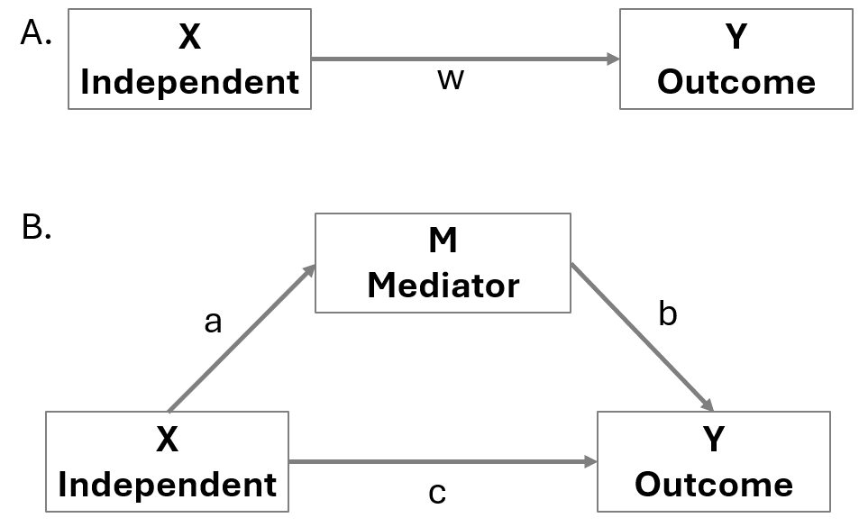
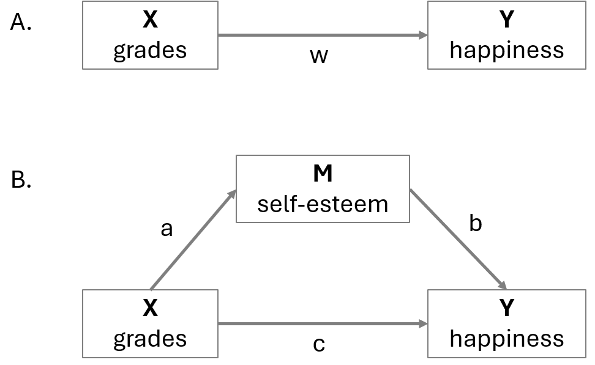
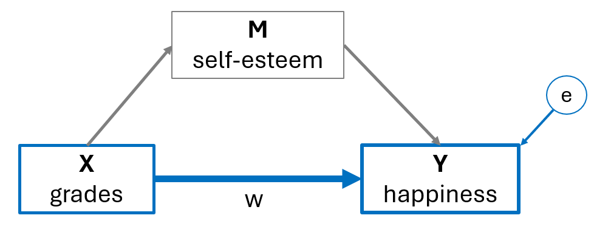
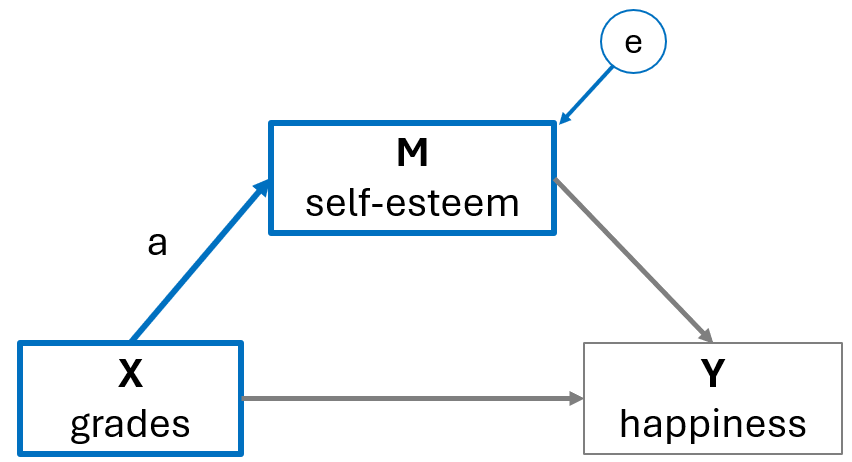
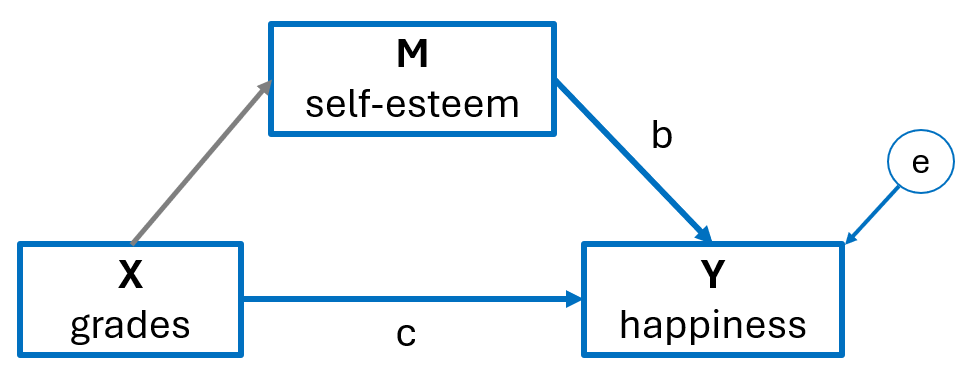
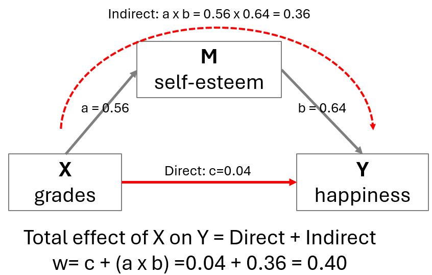
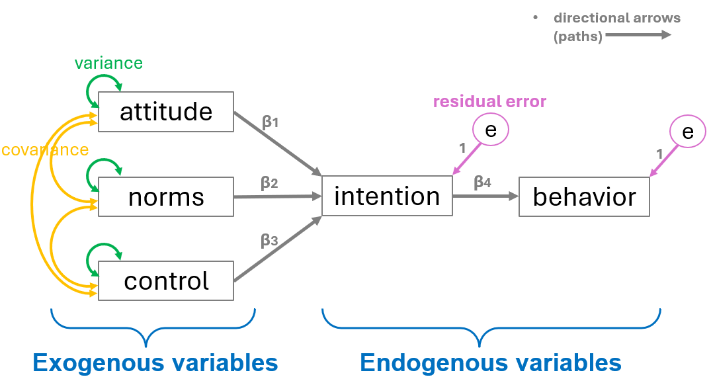
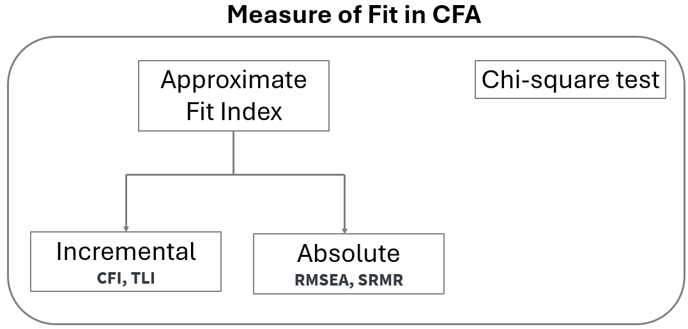

# Mediation and Path Analysis {#sec-path}

```{r}
#| include: false

library(fontawesome)

library(kableExtra)
```

::: {.callout-tip appearance="simple"}
## Get the Code

You can download the complete R script from here:

<a href="https://osf.io/download/tby47/" download="psy400_8.R"> <button type="button" class="btn btn-primary"> <i class="bi bi-download"></i> Download R Script </button> </a>
:::

::: {.callout-tip appearance="simple"}
## Get the Data happiness

You can download the Excel dataset **happiness** from here:

<a href="https://osf.io/download/vnqke/" download="happiness.xlsx"> <button type="button" class="btn btn-success"> <i class="bi bi-file-earmark-excel"></i> Download Excel Data </button> </a>
:::

::: {.callout-tip appearance="simple"}
## Get the Data PlannedBehavior

You can download the Excel dataset **PlannedBehavior** from here:

<a href="https://osf.io/download/syaq9/" download="PlannedBehavior.xlsx"> <button type="button" class="btn btn-success"> <i class="bi bi-file-earmark-excel"></i> Download Excel Data </button> </a>
:::

<br>

First, we load the following R packages in our R session:

```{r}
#| warning: false 

# Required packages for this R script
library(lavaan)
library(semPlot)
library(readxl)
```

## Mediation analysis

A single mediation analysis is based on the estimation of the four pathways, w, a, b, and c shown in @fig-path001. In @fig-path001**(A)**, the "w" path represents the total X→Y effect. In @fig-path001**(B)**, the "a" path represents the X→M effect, the "b" path represents the M→Y effect, and the "c" path represents the direct X→Y effect. In traditional mediation analysis, the paths coefficients are estimated using linear regression equations.

Mediation analysis is based on the assumption of temporal precedence of the independent variable X, mediator, and outcome, which means that changes in the X are assumed to precede changes in the mediator, and that changes in the mediator are assumed to precede changes in the outcome.

 

{#fig-path001 width="65%"}

It is important to note that, like any regression-based analysis, mediation analysis cannot establish causal associations unless it is grounded in an experimental design. Drawing causal inferences requires rigorous methodological controls, including random assignment, temporal precedence, and the elimination of alternative explanations.

 

::: content-box-green
**Direct and indirect effects**

Mediation analysis decomposes the total X→Y effect (w) into a direct effect (c) and an indirect effect through a mediator variable, which is the product of a and b (axb).
:::

 

## Example

Assume that previous research has demonstrated that higher grades are associated with increased happiness: X (grades) → Y (happiness) (@fig-path002 A). In our theory, we also hypothesize that good grades enhance self-esteem, which in turn increases happiness: X (grades) → M (self-esteem) → Y (happiness) (@fig-path001 B).

{#fig-path002 width="65%"}

 

## Import the dataset

If the dataset *happiness* is saved in the subfolder named “data” of our RStudio project, we can read it with the `read_excel()` function from `readxl` package as follows:

```{r}
#| warning: false 

dat_happiness <- read_excel("data/happiness.xlsx")
dat_happiness
```

### Baron & Kenny method

The following shows the basic steps for mediation analysis suggested by Baron & Kenny (1986). A mediation analysis is comprised of three sets of regression: (1) X → Y, (2) X → M, and (3) X + M → Y. This 3-step method used to describe a mediation effect. Steps 1 and 2 use basic linear regression while steps 3 use multiple regression.

-   **Step 1:** Estimate the association between X on Y (grades on happiness). The **total effect** “w” must be significantly different from 0. If there is no association between X and Y, there is nothing to mediate.

{width="65%"}

$$Y = intercept \ + \text{w} \cdot X + e$$

where $e$ is the residual error of the model.

```{r}
step_1 <- lm(happiness ~ grades, data = dat_happiness)
summary(step_1)
```

 

$$happiness = 2.86 \ + 0.40 \cdot grades$$ Therefore, the total effect w = 0.40 is statistical significant (p\<0.001).

(**NOTE:** Even if we don’t find a significant association between X and Y, we could move forward to the next step if we have a good theoretical background about their association.)

 

-   **Step 2:** Estimate the association between X on M (grades on self-esteem). Path “a” must be significantly different from 0; The independent variable and the mediator must be associated. If X and M have no association, M is just a third variable that may or may not be associated with Y. A mediation makes sense only if X affects M.

{#fig-path5 width="65%"}

$$M = intercept \ + \text{a} \cdot X + e$$

where $e$ is the residual error of the model.

```{r}
step_2 <- lm(selfesteem ~ grades, data = dat_happiness)
summary(step_2)
```

 

$$selfesteem = 1.50 \ + 0.56 \cdot grades$$ Therefore, the effect of X on M (a = 0.56) is statistical significant (p\<0.001).

 

-   **Step 3:** Estimate the effects of both X and M on Y. Path “b” must be significantly different from 0; mediator and outcome must be associated. Additionally, the path “c” should be non-significant and nearly 0. The effect of X on Y will disappear (full mediation) or at least weaken (partial mediation) when M is included in the regression. The effect of X on Y goes through M.

{#fig-path6 width="65%"}

$$Y = intercept \ + c \cdot X + \text{b} \cdot M + e$$

where $e$ is the residual error of the model.

```{r}
step_3 <- lm(happiness ~ grades + selfesteem, data = dat_happiness)
summary(step_3)
```

 

$$happiness = 1.90 \ + 0.04 \cdot grades + 0.64 \cdot selfesteem$$

Therefore, the effect of M (self-esteem) on Y (happiness), controlling for X (grades), is statistically significant (b = 0.64, p \< 0.001), whereas the effect of X (grades) on Y (happiness), controlling for M (self-esteem), is weakened and not statistically significant (c = 0.04, p = 0.719).

 

**Total, direct and indirect effects**

-   The total effect (w = 0.40) is just the coefficient (w) we would find by fitting a simple regression model (e.g., $Y = intercept \ + \text{w} \cdot X$).

-   The indirect effect is the effect of X on Y, through the mediator M. It’s obtained by multiplying $a \times b = 0.56 \times 0.64 = 0.36$.

-   The direct effect (c = 0.04) is the partial effect of of X on Y after controlling for M.

{#fig-path7 width="65%"}

In practice, a simple mediation model decompose the total effect of X on Y, in a direct and indirect effect. Therefore:

$$w = c + (a \times b) = 0.04 + (0.56 \times 0.64) = 0.04 + 0.36 = 0.40$$

### Mediation Analysis with R

We specify and estimate our mediation model using the `sem()` function from the **`lavaan`** package in R.

```{r}
# 1. Define the model
# a = path from grades to self-esteem
# b = path from self-esteem to happiness
# c = direct path from grades to happiness

mediation_model <- '
  # Regressions
  selfesteem ~ a*grades
  happiness  ~ c*grades + b*selfesteem

  # Define the effects for the summary output
  direct   := c
  indirect := a * b
  total    := c + (a * b)
'

# 2. Fit the model 
med_model <- sem(model = mediation_model, data = dat_happiness)

# 3. View the results
summary(med_model, standardize = TRUE)
```

The path estimates (regression coefficients):

-   $a=0.56$ (p \<0.001)
-   $b=0.64$ (\<0.001)
-   $c = 0.04$ (p = 0.714).

 

The mediation estimates:

-   The direct effect ($c = 0.04$; p = 0.714)
-   The indirect effect ($a \times b = 0.36$; p \<0.001).
-   The total effect ($w = c + a \times b = 0.40;$ p\<0.001)

 

We can also represent the mediation estimates in a plot:

```{r}
ly <- matrix(c(
  0,  1,  
  1, -1,  
  -1, -1   
), ncol = 2, byrow = TRUE)

semPaths(med_model, 
         whatLabels = "est",
         layout = ly, 
         nCharNodes = 0,           # Use full names
         shapeMan = "rectangle",   
         sizeMan = 18,             
         sizeMan2 = 12,            
         residuals = FALSE,        
         intercepts = FALSE,       
         color = "white",          
         edge.color = "black",     
         edge.label.cex = 1.8,     
         asize = 5)

```

 

## Path analysis

### Basic concepts

Path analysis can be used to test more complex theories of **observed variables** (or manifest variables). It is an extension of multiple regression and is used primarily to examine direct and indirect associations among variables.

In this example, we look at the theory of planned behavior (TPB). This theory is a psychological theory that links beliefs to behavior. In its simplified form, the TPB proposes that an individual's intention to perform a specific behavior influences the individual’s decision to enact that behavior, and attitude toward the behavior, perception of norms pertaining to that behavior, and perception of control over performing that behavior influence the individual’s intention to perform the behavior.

We can specify the Theory of Planned Behavior as a path diagram by drawing the observed variables and the directional associations (paths) between the variables as implied by the theory, where rectangles represent the variables and directional arrows represent the directional relations between variables, which is depicted in the path diagram below:

{#fig-path27 width="85%"}

-   **Exogenous variables:** Independent variables that are influenced by factors outside the model and, in turn, influence endogenous variables. In path diagrams, arrows originate from exogenous variables but do not point to them.

-   **Endogenous variables:** Dependent variables that are explained by exogenous variables in the model. Arrows point toward them and these represent causal paths. Note that an endogenous variable may also be specified as the predictor of another endogenous variable, as is the case in our example path diagram.

-   **Path coefficients** are regression coefficients (typically denoted as $\beta_1-\beta_4$, or sometimes as $p_1-p_4$) that represent direct effects of one variable on another.

-   **Variances** are typically represented as curved double-sided arrows, where both arrows point to the same variable. **Covariances** are also represented as double-sided arrows in which the arrows connect two distinct variables.

-   **(Residual) error terms** (which are sometimes called disturbances) are added to **endogenous variables**.

The equations of this model are:

$$intention = intercept +  \beta_1 attitude + \beta_2 norms + \beta_3 control + e$$

and

$$behavior = intercept + \beta_4 intention + e$$

 

### Model Identification

Model identification refers to determining whether there is sufficient information in the observed data to estimate the model’s parameters (e.g., regression coefficients, variances) uniquely.

-   A model is **overidentified** when there are more unique (non-redundant) sources of information than free parameters, which means that the degrees of freedom (df) is greater than zero. This is ideal because it allows for both parameter estimation and model fit testing.

-   A **just-identified** model has an equal number of unique sources of information and free parameters; while the model can be estimated, its fit to the data cannot be tested.

-   An **underidentified** model has fewer unique sources of information than parameters, meaning it lacks enough information to estimate all free parameters, making it impossible to fit the model reliably.

The formula for calculating the number of unique (non-redundant) sources of information available for a particular model is as follows:

$$i = \frac{p \cdot (p+1)}{2}$$

where $p$ is the number of observed variables to be modeled.

In the path diagram we specified above, there are five observed variables: Attitude, Norms, Control, Intention, and Behavior. Thus, in the following formula, $p$ is equal to 5, and thus the number of unique (non-redundant) sources of information is 15.

$$i = \frac{5 \cdot (5+1)}{2} = \frac{30}{2} = 15$$

To count the number of free parameters ($k$), simply add up the number of the specified direction relations, variances, covariances, and error terms in the path analysis model. In our example:

$$k=12$$

To calculate the degrees of freedom ($df$) for the model, subtract the number of free parameters from the number unique (non-redundant) sources of information, which in this example is equal to 3, as shown below.

$$df = i - k = 15 - 12 = 3$$

Thus, the degrees of freedom for the model is 3, which means the model is over-identified.

 

### Model Fit in path analysis

There are many measures of fit in path analysis:

{#fig-cfa501 width="70%"}

-   **Chi-square test**. The chi-square test can be used to assess whether the model fits the data adequately. A non-significant chi-square value (e.g., p ≥ 0.05) indicates that the model fits the data reasonably well. However, the test is highly sensitive to sample size—tending to yield non-significant results in small samples even when fit is poor, and significant results in large samples even when the model fits well.

-   **The Comparative Fit Index (CFI):** The CFI is an incremental fit index, meaning it evaluates how much the hypothesized model improves upon a baseline (or null) model that assumes no associations among variables. CFI values range from 0 to 1, with higher values indicating better fit. (Rule of thumb: CFI values above 0.90 are generally considered indicative of acceptable model fit, while values above 0.95 suggest a good model fit).

-   **Tucker-Lewis Index (TLI):** The TLI penalizes model complexity more heavily than the CFI. TLI values can sometimes exceed 1.0, making the index somewhat unstable. Given the close association between TLI and CFI, it is generally recommended to report only one of the two.

-   **RMSEA (Root Mean Square Error of Approximation):** The RMSEA is an absolute fit index interpreted as a badness-of-fit measure, with 0.00 indicating a perfect fit. It tends to favor models with more degrees of freedom and larger sample sizes. A unique feature of RMSEA is that it is accompanied by a 90% confidence interval. Although there is ongoing debate about acceptable RMSEA values, a common consensus is that $RMSEA \geq 0.10$ indicates poor fit, while $RMSEA \leq 0.05$ suggests a good fit. When interpreting the RMSEA, it's important to examine the upper bound of the confidence interval to ensure it does not approach problematic levels.

-   **SRMR (Standardized Root Mean Square Residual):** The SRMR is another absolute fit index and, like RMSEA, is a badness-of-fit statistic—values closer to 0.00 indicate better fit. The SRMR is a standardized version of the Root Mean Square Residual (RMR), which measures the mean absolute covariance residual. Standardization facilitates interpretation across different models. Poor model fit is typically flagged when $SRMR \geq 0.10$.

According to Hu and Bentler (1999), an acceptable fit is achieved when $CFI \geq 0.95$ and $SRMR \leq 0.08$—a guideline known as the combination rule. This recommendation, however, remains a topic of debate.

The conventional cutoffs for the aforementioned model fit indices – like any rule of thumb – should be applied with caution. Additionally, these indices do not always align with one another, which is why researchers often examine multiple fit indices to make an informed judgment about whether a model adequately fits the data.

 

## Import the dataset

If the dataset *PlannedBehavior* is saved in the subfolder named “data” of our RStudio project, we can read it with the `read_excel()` function from `readxl` package as follows:

```{r}
#| warning: false 

dat_behavior <- read_excel("data/PlannedBehavior.xlsx")
dat_behavior
```

There are 5 variables and 199 cases in the data frame.

## Path Analysis in R

### The path model with lavaan

We specify and estimate our path model using the `sem()` function from the **`lavaan`** package in R.

```{r}
# Define the path model for Theory of Planned Behavior
tpb_model <- '
  # Predicting Intention
  intention ~ b1*attitude + b2*norms + b3*control
  
  # Predicting Behavior
  behavior ~ b4*intention

  # Intercepts (Explicitly defined)
  intention ~ 1
  behavior ~ 1

  # Indirect effects
  indirect_att := b1 * b4
  indirect_norm := b2 * b4
  indirect_ctrl := b3 * b4
'

tpb_fit <- sem(tpb_model, data = dat_behavior)

summary(tpb_fit, 
        fit.measures = TRUE, 
        standardized = TRUE, 
        rsquare = TRUE)
```

 

### Explantion of the results

Let's examine the most interesting results separately for each group of estimates and measures.

**Intercepts of the model equations**

The intercepts of the equations of the model are following:

```{r}
#| echo: false

# Extract all parameter estimates with standardized values
all_params <- parameterEstimates(tpb_fit, standardized = TRUE)

all_intercepts <- all_params[grepl("~1", all_params$op), ]

all_intercepts[1:2, c("lhs", "est", "se", "z", "pvalue", "ci.lower", "ci.upper", "std.all")]
```

 

**Regression (Path) Coefficients**

The direct effects (path coefficients) are obtained from regression analysis. The following table summarizes hypotheses testing results of the study.

```{r}
#| echo: false

# Filter for only the regression paths (op == "~")
regressions_only <- all_params[all_params$op == "~", ]

regressions_only[, c("lhs", "rhs", "label", "est", "se", "z", "pvalue", "ci.lower", "ci.upper", "std.all")]
```

The path coefficient (i.e., regression coefficient b) between attitude and intention is statistically significant and positive ($b_1 = 0.352$, p \< 0.001). The path coefficient between norms and intention is statistically significant and positive ($b_2 = 0.153$, p = 0.010). The path coefficient between control and intention is statistically significant and positive ($b_3 = 0.275$, p \< 0.001). Of the three predictors of intention, attitude exhibited the strongest relative effect (i.e., the statndardized estimate is $std.all = 0.370$). Finally, the path coefficient between intention and behavior is statistically significant and positive ($b_4 = 0.453$, p \< 0.001).

 

According to results of the above tables, the equations can be expressed as follows:

$$intention = 0.586 + 0.352 \cdot attitude + 0.153 \cdot norms + 0.275 \cdot control$$

and

$$behavior = 1.743 + 0.453 \cdot intention$$

 

**R-Squared values**

```{r}
#| echo: false
#| 
inspect(tpb_fit, "rsquare")
```

We see the R-Squared value for the outcome variable intention, which is equal to 0.369; that is, collectively, attitude, norms, and control explain 36.9% of the variance in intention. Additionally, intention explains 19.8% of the variance in behavior.

 

**Indirect Effects**

Moreover, the indirect effects are reported in the following table:

```{r}
#| echo: false

indirect_all <- all_params[all_params$op == ":=", ]

indirect_all[, c("lhs", "rhs", "est", "se", "z", "pvalue", "ci.lower", "ci.upper", "std.all")]

```

For example, the estimate for the indirect effect of the path attitude=\>intention=\>behavior is calculated as 0.35\*0.45 = 0.16.

 

**Variances and Covariances**

```{r}
#| echo: false

var_cov_table <- all_params[all_params$op == "~~", ]

var_cov_table[, c("lhs", "rhs", "est", "se", "z", "pvalue", "ci.lower", "ci.upper", "std.all")]

```

Using path analysis, we can also explicitly model the variance of the exogenous variables (e.g., attitude-attitude variance = 0.93), the covariances (correlations) between the exogenous variables (e.g., norms-attitude covariance= 0.20), and the residual errors of the endogenous variables in the model (e.g., intention res. error = 0.53).

 

We can also present the model with a path diagram. All options regard aesthetics of the diagram are shown below:

```{r}

# 1. Define the grid layout manually
# Rows represent vertical position, Columns represent horizontal flow
ly <- matrix(NA, nrow = 3, ncol = 3)
ly[1, 1] <- "attitude"
ly[2, 1] <- "norms"
ly[3, 1] <- "control"
ly[2, 2] <- "intention"
ly[2, 3] <- "behavior"

# 2. Plot without the 'groups' argument to avoid the subscript error
semPaths(tpb_fit, 
         whatLabels = "est",    # Show standardized weights
         layout = ly, 
         style = "ram",      # Professional SEM style
         nCharNodes = 0,        # Don't abbreviate variable names
         intercepts = FALSE,    # Don't plot the constant/intercept nodes
         residuals = TRUE,      # Show the error terms
         sizeMan = 12,          # Size of the boxes
         sizeMan2 = 8, 
         mar = c(5, 5, 5, 5),
         edge.label.cex = 1.2,  # Size of the path numbers
         fade = FALSE,          # Keep all lines solid black for print
         color = "white",       # Standard textbook white boxes
         edge.color = "black")
```

### Assessment of Model Fit

The path model for the Theory of Planned Behavior demonstrated an excellent fit to the data. The chi-square test was non-significant, $\chi^2(3) = 2.023, p = 0.568$, suggesting no significant discrepancy between the hypothesized model and the observed data. Complementary fit indices further supported this conclusion, with a Comparative Fit Index (CFI) of $1.000$ and a Tucker-Lewis Index (TLI) of $1.017$, both exceeding the traditional $0.95$ threshold for superior fit. The Root Mean Square Error of Approximation (RMSEA) was $0.000$ ($90\%$ CI $[0.000, 0.103]$), and the Standardized Root Mean Square Residual (SRMR) was $0.017$, well below the recommended $0.05$ and $0.08$ cut-offs, respectively. Overall, these measures indicate that the model provides a highly robust representation of the relationships between attitude, social norms, perceived control, intention, and behavior
