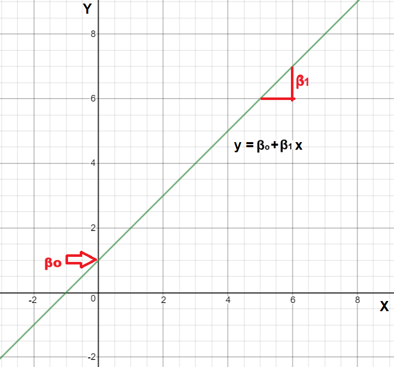
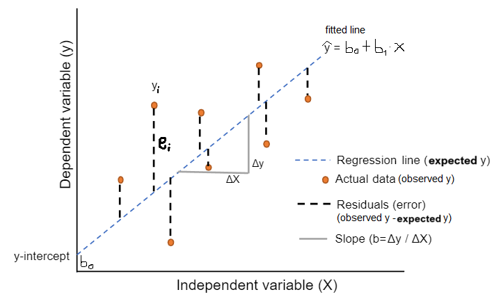

# Simple Linear regression {#sec-simplelinear}

```{r}
#| include: false

library(fontawesome)

library(kableExtra)
library(moderndive)
```


::: {.callout-tip appearance="simple"}
## Get the Code

You can download the complete R script from here:

<a href="https://osf.io/download/ubf9g/" download="psy400_3.R"> <button type="button" class="btn btn-primary"> <i class="bi bi-download"></i> Download R Script </button> </a>
:::

::: {.callout-tip appearance="simple"}
## Get the Data sat

You can download the Excel dataset **sat** from here:

<a href="https://osf.io/download/ru5jx/" download="sat.xlsx"> <button type="button" class="btn btn-success"> <i class="bi bi-file-earmark-excel"></i> Download Excel Data </button> </a>
:::

<br>

First, we load the following R packages in our R session:

```{r}
#| warning: false 

# Required packages for this R script
library(tidyverse)
library(ggstatsplot)
library(readxl)
```

<br>

Simple linear regression involves a numeric dependent (or response) variable $Y$ and one independent (or explanatory) variable $X$ that is either numeric or categorical.


## Import dataset and process the data variables

If the dataset *birthweight* is saved in the subfolder named “data” of our RStudio project, we can read it with the `read_excel()` function from `readxl` package as follows:

```{r}
#| warning: false 

dat <- read_excel("data/birthweight.xlsx")
dat
```


Data of 550 infants at 1 month age was collected. The following variables were recorded:

• Body weight of the infant in g (weight)

• Body height of the infant in cm (height)

• Head circumference in cm (headc)

• Gender of the infant (gender: Female, Male)

• Birth order in their family (parity: Singleton, One sibling, 2 or more siblings)

• Education of the mother (education: tertiary, year10, year12)

We convert `gender`, `parity`, and `education` into factor variables using the **`factor()`** function within **`mutate()`**, as factors are used in R to represent categorical data. Specifying the levels argument defines the ordering of categories, which is important for setting the reference category in regression models and for controlling how categories are displayed in summaries or plots.


```{r}
dat <- dat |> 
  mutate(gender = factor(gender),
         parity = factor(parity,
                         levels = c("Singleton", "One sibling", "2 or more siblings")),
         education = factor(education,
                            levels = c("tertiary", "year10", "year12")))

dat
```


## Simple linear regression with a continuous explanatory variable

Often it is of interest to quantify the linear association between two continuous variables, $X$ and $Y$, and given the value of one variable for an individual, to predict the value of the other variable. This is not possible from the correlation coefficient as it simply indicates the strength of the association as a single number; in order to describe the association between the values of the two variables, a technique called regression is used. In regression, we assume that a change in the independent variable, $X$, will lead directly to a change in the dependent variable $Y$. However, the term "dependent" does not necessarily imply a cause-and-effect relationship between the two variables.

We may recall from secondary/high school algebra that the equation of a line is: $$y = \beta_o + \beta_1 \cdot x$$ {#eq-line1}

{#fig-line width="50%"}

The @eq-line1 is defined by two coefficients (parameters) $\beta_o$ and $\beta_1$.

-   The **intercept coefficient** $\beta_o$ is the value of $y$ when $x = 0$ (the point where the fitted line crosses the y-axis; @fig-line).

-   The **slope coefficient** $\beta_1$ for $x$ is the mean change in $y$ for every one unit increase in $x$ (@fig-line).

 

### Research question

Let’s say that we want to model the association between height and weight for the sample of 550 infants of 1 month age. In other words, we want to find the parameters of a mathematical equation, such as $y = \beta_o + \beta_1 \cdot x$.


### Hypothesis Testsing

::: {.callout-note icon="false"}
## Null hypothesis and alternative hypothesis

-   $H_{0}:$ the two variables are not linearly related. There is no effect between height and weight ($β_1 = 0$).

-   $H_{1}:$ the two variables are linearly related. There is an effect between height and weight ($β_1 \neq 0$).
:::

### Correlation

We begin by visualizing the correlation between the two variables (`height`, `weight`). A scatter plot is a useful first step because it helps us assess the pattern, strength, and direction of the association between the variables before proceeding to formal modeling.

```{r}
ggplot(dat, aes(x = height, y = weight)) +
  geom_point() +
  geom_smooth(method = "lm", se = FALSE)
```


The points in the plot seem to be scattered around a line. The scatter plot also shows that, in general, infants with high height tend to have high weight (positive association).


To quantify the strength of this linear association, we calculate the Pearson correlation coefficient ($r$). This value ranges from $-1$ to $1$, where $1$ indicates a perfect positive linear association.

```{r}
cor(dat$height, dat$weight)
```


### Fit a simple linear regression model

To select the best fitting straight line of the data set, it is necessary to estimate the values $b_o$ and $b_1$ of parameters $\beta_o$ and $\beta_1$ in @eq-line1. The regression equation of the model becomes:

$$\widehat{y} = b_o  + b_1 \cdot x$$ {#eq-line2}

Why do we put a "hat" on top of the $y$? It's a form of notation commonly used in regression to indicate that we have a **expected value**, or the value of $y$ **on the regression line** for a given $x$ value.


- **Fit the model**

We fit a simple linear regression model to estimate the association between height (independent variable) and weight (dependent variable).

```{r}
# Fit the model
model_height <- lm(weight ~ height, data = dat)
```

 

- **Normality of the residuals**

First, let's check the assumption that the standardized residuals are normally distributed using a normal Q-Q plot:

```{r}
#| label: fig-scat6
#| fig-cap: Normal Q-Q plot of the residuals.

# Extract residuals from your model
std_resids <- rstandard(model_height)

qqnorm(std_resids)
qqline(std_resids, col = "red")
```

The @fig-scat6 shows no significant deviation from normality.

 


- **Model Summary**

To view the statistical details of our model, we use the `summary()` function.

```{r}
summary(model_height)
```


 

In the Estimate column, we find the values necessary to build our linear equation: the intercept ($b_o = -5412$) and the slope ($b_1 = 178$). The resulting equation for the regression line is:

$$
\begin{aligned}
\widehat{y} &= b_o + b_1 \cdot x\\
\widehat{\text{weight}} &= b_o + b_1 \cdot\text{height}\\
\widehat{\text{weight}}&= -5412 + 178\cdot\text{height}
\end{aligned}
$$

 

### Interpretation of the coefficients


**The intercept** $b_o$

The intercept $b_o =5412$ is the average weight for those infants with height of 0. In graphical terms, it's where the line intersects the $y$ axis when $x$ = 0 (@fig-intercept). Note, however, that while the intercept of the regression line has a mathematical interpretation, it has no *physical* interpretation here, since observing a weight of 0 is impossible.

```{r}
#| echo: false
#| warning: false
#| label: fig-intercept
#| fig-cap: Data of infants’ body height-body weight with fitted line crossing the y-axis.
#| fig-width: 7.0
#| fig-height: 5.5


plot(dat$height, dat$weight, xlab="infant's body height (cm)", xlim=c(0, 70), xaxs="i", ylab="infant's body weight (g)",ylim=c(-6000, 7000), col="green")
abline(model_height, col="red") 
text(x=10,y=-2900, label="fitted line", srt=25, cex=1) 
text(49, -4300, bquote(paste (hat(weight), "= -5412.15+178.31*height")),col="black", cex=0.95)
```

 

**The slope** $b_1$

Of greater interest is the slope of height, $b_1 = 178$, as it summarizes the association between the height and weight variables.

```{r}
#| echo: false
#| warning: false
#| label: fig-slope
#| fig-cap: Scatter plot of infants’ body height-body weight and graphically calculation of the slope.
#| fig-width: 7.2
#| fig-height: 5.8

plot(dat$height, dat$weight, xlab="infant's body height (cm)", ylab="infant's body weight (g)", col="green", cex.lab=1.08) 
abline(model_height, col="red") 
segments(56, 4556, 60, 4556) 
segments(60, 4556, 60, 5268) 
text(x=55.6,y=4800, label="(56, 4560)") 
text(x=59,y=5400, label="(60, 5270)") 
text(x=58,y=4400, label="dx") 
text(x=60.5,y=4900, label="dy") 
text(x=48.8,y=3500, label="fitted line", srt=22, cex=1.1)
text(55.7, 3400, bquote(paste (hat(weight), "= -5412.15+178.31*height")),col="black", cex=0.9)
```

The graphical calculation of the slope from two points of the fitted line is (@fig-slope):

$$  
b =\frac{dy}{dx}=\frac{5270-4560}{60-56}= \frac{710}{4} \approx 178
$$ Note that, in this example, the coefficient has units g/cm.

Additionally, note that the sign is positive, suggesting a positive association between these two variables, meaning infants with higher height also tend to have higher weight. Recall from earlier that the correlation coefficient was $r = 0.71$. They both have the same positive sign, but have a different value. Recall further that the correlation's interpretation is the "strength of linear association". The slope's interpretation is a little different:

> For every 1 cm increase in height, there is **on average** an associated increase of 178 g of weight.

We only state that there is an **associated** increase and not necessarily a **causal** increase. In other words, just because two variables are strongly associated, it doesn't necessarily mean that one causes the other. This is summed up in the often quoted phrase, "correlation is not necessarily causation."

Furthermore, we say that this associated increase is **on average**  178 g of weight, because we might have two infants whose height differ by 1 cm, but their difference in weight won't necessarily be exactly . What the slope is saying is that, **across all possible infants, the *average* difference in weight between two infants whose height differ by 1 cm is 178 g**.

 

### The Standard error (SE) of the slope

The **Std. Error column** of the statistical results of the model corresponds to the *standard error* of our estimates. We are interested in understanding the standard error of the slope ($\text{SE}_{b_1}$).


The standard error is a way to measure the “uncertainty” in the estimate of the regression coefficients. In general, a smaller standard error indicates a more precise estimate. For example, the estimated coefficient for the independent variable height is 178.31. **Its standard error is 7.49**, which reflects the amount of sampling variability in the estimated regression slope. In other words, if we repeatedly drew similar samples and refit the model, the estimated slope would vary from sample to sample, and the standard error quantifies that variation.

 

### Test statistic and confidence intervals for the slope

The **t value column** of the statistical results of the model corresponds to a *t-statistic*. The hypothesis testing for the slope is:

$$
\begin{aligned}
H_0 &: \beta_1 = 0\\
\text{vs } H_1&: \beta_1 \neq 0.
\end{aligned}
$$

The null hypothesis, $H_{0}$, states that the coefficient of the independent variable (height) is equal to zero, and the alternative hypothesis, $H_{1}$, states that the coefficient of the independent variable is not equal to zero.

The **t-statistic** for the slope is defined by the following equation:

$$\ t = \frac{\ b_1}{\text{SE}_{b_1}}$$ {#eq-tstats}

In our example:

$$\ t = \frac{\ b_1}{\text{SE}_{b_1}}=\frac{\ 178.31}{\text{7.49}} = 23.81$$

In practice, we use the p-value to guide our decision:

-   If p − value \< 0.05, reject the null hypothesis, $H_{0}$.
-   If p − value ≥ 0.05, do not reject the null hypothesis, $H_{0}$.

In our example p \<0.001 $\Rightarrow$ reject $H_{0}$.

The $95\%$ CI of the coefficient $b$ for a significance level α = 0.05, $df=n-2 = 550 - 2 = 548$ degrees of freedom and for a two-tailed t-test is given by:

$$ 95\% \ \text{CI}_{b} = b \pm t_{548; 1-a/2} \cdot \text{SE}_{b_1}$$ {#eq-tci}


We can fine the critical value $t_{548; 1-a/2}$ in R using the following command:

```{r}
# For two-tailed alpha = 0.05, we look at the 0.975 percentile
qt(0.975, df = 548)
```


Therefore, in our example:

$$ 95\% \ \text{CI}_{b_1} = 178.31 \pm 1.96 \cdot \text{7.49}= 178.31 \pm 14.68 \Rightarrow 95\% \text{CI}_{b_1}= \ (163.6, 193)$$  

 

The 95% CI can be obtained directly in R using the `confint()` function, which computes confidence intervals for model parameters.

```{r}
# Extract 95% Confidence Intervals
confint(model_height, level = 0.95)
```

 

::: {.callout-tip icon="false"}
## Interpretation of linear regression

In summary, we can say that the regression coefficient of the height (178) is significantly different from zero (p \< 0.001) and indicates that there's on average an increase of 178 g ($95\%$CI: 164 to 193) in weight for every 1 cm increase in height. Note that the $95\%$CI does not include the hypothesized null value of zero for the slope.
:::

 

### Observed, expected (fitted) values and residuals

We define the following three concepts:

1.  **Observed** values $y$, or the observed value of the dependent variable for a given $x$ value
2.  **Expected** (or fitted) values $\widehat{y}$, or the value on the regression line for a given $x$ value
3.  **Residuals** $y - \widehat{y}$, or the error (ε) between the observed value and the expected value for a given $x$ value

{#fig-line2 width="70%"}

The residuals are exactly the **vertical** distance between the observed data point and the associated point on the regression line (expected value) (@fig-line2). Positive residuals have associated y values above the fitted line and negative residuals have values below. We want the residuals to be small in magnitude, because large negative residuals are as bad as large positive residuals.

@fig-residuals shows these values:

```{r}
#| echo: false
#| label: fig-residuals
#| fig-cap: Regression points (first 10 out of 550 infants).

regression_points <- get_regression_points(model_height)
regression_points %>%
  slice(1:10) %>%
  knitr::kable(
    digits = 3,
    booktabs = TRUE,
    linesep = ""
  ) %>%
  kable_styling(font_size = ifelse(knitr:::is_latex_output(), 10, 16),
                latex_options = c("hold_position"))
```

Observe in the above table that **weight_hat** contains the expected (fitted) values $\widehat{y}$ = $\widehat{\text{weight}}$.

The **residual** column is simply $e_i = y - \widehat{y} = weight - weight\_hat$.

Let's see, for example, the values for the first infant and have a visual representation:

-   The **observed value** $y$ = 3950 is infant's weight for $x$ = 55.5.

-   The **expected value** $\widehat{y}$ is the value 4483.939 on the regression line for $x$ = 55.5. This value is computed using the intercept and slope in the previous regression in @fig-residuals: $$\widehat{y} = b_o + b_1 \cdot x = -5411.953 + 178.296 \cdot 55.5 = 4483.48$$

-   The **residual** is computed by subtracting the expected (fitted) value $\widehat{y}$ from the observed value $y$. The residual can be thought of as a model's error or "lack of fit" for a particular observation. In the case of this infant, it is $y - \widehat{y}$ = 3950 - 4483.4 = -533.4 .

A "best-fitting" line refers to the line that **minimizes** the **sum of squared residuals (RSS)**, also known as sum of squared estimate of errors (SSE) out of all possible lines we can draw through the points. The method of least squares is the most popular method used to calculate the coefficients of the regression line.

$$ min(RSS) =min\sum_{i=1}^{n}(y_i - \widehat{y}_i)^2 $$ {#eq-minrss}

In @fig-min_slope, we have found the minimum value of RSS (it turns out to be 97723317) and have drawn a horizontal dashed green line. At the point where this minimum touches the graph, we have read down to the x axis to find the best value of the slope. This is the value 178.

```{r}
#| echo: false
#| warning: false
#| message: false
#| label: fig-min_slope
#| fig-cap: The sum of the squares of the residuals against the value of the coefficient of the slope which we are trying to estimate.
#| fig-width: 7.2
#| fig-height: 5.8

b <- seq(70, 285, 1) 
sse <- numeric(length(b)) 

for (i in 1:length(b)) { 
  a <- mean(dat$weight)-b[i]*mean(dat$height) 
  residual <- dat$weight - a - b[i]* dat$height 
  sse[i] <- sum(residual^2) }

plot(b, sse, type="l", ylim=c(90000000, 128460432), xlab=bquote(hat(b)[1]), ylab="RSS") 
arrows(178, 97723317, 178, 88500000, length = 0.1, col="red") 
abline(h=97723317,col="green", lty=2) 
lines(b,sse)
text(x=178, y=101723317, bquote("min \n(178, 97723317)"), col="black", cex=0.8)
```

 

### Quality of a linear regression fit

The quality of a linear regression fit is typically assessed using two related quantities: residual standard error (RSE) and the coefficient of determination R$^2$.

**Residual standard error (RSE)**

RSE represents the average distance that the observed values fall from the regression line. Conveniently, it tells us how wrong the regression model is on average using the units of the response variable. Smaller values are better because it indicates that the observations are closer to the fitted line. In our example:

$$\ RSE = \sqrt{\frac{\ RSS}{n-2}}= \sqrt{\frac{\ 97723317}{550-2}}= 422.3$$ {#eq-rse}

 

**Coefficient of determination R**$^2$

The R$^2$ is the fraction of the total variation in $y$ that is explained by the regression.

$$\ R^2 = \frac{\ explained \ \ variation}{total \ \ variation}$$ {#eq-r2}

The R$^2$ value is called the **coefficient of determination** and indicates the percentage of the variance in the dependent variable that can be explained or accounted for by the independent variable. Hence, it is a measure of the **'goodness of fit'** of the regression line to the data. It ranges between 0 and 1 (it won't be negative). An R$^2$ statistic that is close to 1 indicates that a large proportion of the variability in the response has been explained by the regression. A number near 0 indicates that the regression did not explain much of the variability in the response.

In our example takes the value 0.509. It indicates that about 50.9% of the variation in infant's body weight can be explained by the variation of the infant's body height. In simple linear regression $\sqrt{0.509} = 0.713$ which equals to the Pearson's correlation coefficient, r.

 


## Simple linear regression with a binary explanatory variable

Using the same sample of 550 infants of 1 month age we want to examine how body weight is associated with the gender of the infant. Now we have an explanatory variable x that is binary (Male/Female), as opposed to the numerical explanatory variable model (height) that we used previously.

A graphical comparison of the weight between the males and females is presented below using the **`ggbetweenstats()`** function from the **_ggstatsplot_** package:


```{r}
#| label: fig-scat12
#| fig-cap: Violin plot by gender.

ggbetweenstats(data = dat, x = gender, y = weight,
  type = "parametric",
  plot.type = "boxviolin",
  results = FALSE)
```


To include gender in a mathematical equation, we use an indicator variable (often called a *dummy variable*). All cases in which the infant is Male will be coded as 1 and all other cases, in which the infant is Female, will be coded as 0 (reference category). For our model, we define $genderMale$ as follows:

$$
\text{genderMale} =
\begin{cases} 
1 & \text{if infant is Male} \\
0 & \text{otherwise (reference)}
\end{cases}
$$


By including this indicator into the standard linear equation, the model takes the following form:

$$
\begin{aligned}
\widehat{\text{weight}} &= b_o + b_1 \cdot\text{genderMale}
\end{aligned}
$$

In R, the **`lm()`** function automatically detects the factor type and applies this coding:

```{r}
# Fit the model
model_gender <- lm(weight ~ gender, data = dat)
summary(model_gender)
```


Based on the model coefficients, our specific equation becomes:

$$
\begin{aligned}
\widehat{\text{weight}} &= 4140 + 452 \cdot\text{genderMale}
\end{aligned}
$$

- **The Intercept ($b_0 = 4140$):** This is the expected weight for the reference group (Female). When $genderMale = 0$, the equation simplifies to 4140 g. Thus, the intercept represents the mean weight of female infants.


- **The Slope ($b_1 = 452$):** This is the mean difference between the groups. It tells us that male infants are, on average, 452 g heavier than female infants.


We also calculate the 95% Confidence Interval (CI) for the model parameters:

```{r}
confint(model_gender, level = 0.95)
```


Therefore, the mean weight of a male infant is (4140 + 452) 4592 g which is significantly higher (on average) about 452 g relative to a female infant (p\<0.001). The 95% confidence interval for this estimation (the difference in means) is 358 to 545 g.

It is important to note that the above analysis is equivalent to run an independent two-sample t-test.

```{r}
t.test(weight ~ gender, var.equal = TRUE, data = dat)
```


 


## Simple linear regression with a categorical explanatory variable (\> 2 categories)

Suppose that infants are categorized into three categories based on parity: singletons, having one sibling, or having 2 or more siblings. **We choose as the reference category the singleton infants.**

A graphical comparison of the weight between the males and females is presented below using the **`ggbetweenstats()`** function from the **_ggstatsplot_** package:


```{r}
#| label: fig-scat14
#| fig-cap: Violin plot by parity.

ggbetweenstats(data = dat, x = parity, y = weight,
  type = "parametric",
  plot.type = "boxviolin",
  results = FALSE)
```


When an explanatory variable, such as Parity, contains three or more categories, we extend the "dummy variable trick." For a variable with $k$ categories, we must create $k-1$ dummy variables. One category is always left out to serve as the Reference Category (or baseline), against which all others are compared.

To include Parity in our regression equation, we create two indicator variables (dummy variables):


$$
\text{parityOne sibling} =
\begin{cases} 
1 & \text{if infant has one sibling} \\
0 & \text{otherwise}
\end{cases}
$$

$$
\text{parity2 or more siblings} =
\begin{cases} 
1 & \text{if infant has 2 or more siblings} \\
0 & \text{otherwise}
\end{cases}
$$

The equation of the regression line will have the following form:

$$
\begin{aligned}
\widehat{\text{weight}} &= b_o + b_1 \cdot\text{parityOne sibling} + b_2 \cdot\text{parity2 or more siblings}
\end{aligned}
$$

Therefore, we are including all the categories to the linear regression model except the one which is going to be used as the reference category (here is the Singleton). Actually, we create a multiple regression model which we will examine in the next lecture analytically.


In R, the **`lm()`** function automatically detects the factor type and applies this coding:

```{r}
# Fit the model
model_parity <- lm(weight ~ parity, data = dat)
summary(model_parity)
```


Based on the model coefficients, our specific equation becomes:

$$
\begin{aligned}
\widehat{\text{weight}} &= 4259 + 130 \cdot\text{parityOne sibling} + 192 \cdot\text{parity2 or more siblings}
\end{aligned}
$$

- **The Intercept ($b_0 = 4259$):** This is the mean weight of Singleton infants. In the equation, this is the value of $\widehat{y}$ when both dummy variables are set to $0$.

- **Coefficient $b_1 = 130$:** This represents the average weight difference between infants with one sibling and the reference group (Singletons).

- **Coefficient $b_2 = 192$**: This represents the average weight difference between infants with two or more siblings and the reference group (Singletons).


We also calculate the 95% Confidence Interval (CI) for the model parameters:

```{r}
confint(model_parity, level = 0.95)
```

 

::: content-box-green
**Interpretation**

-   The mean weight for a singleton infant (the reference category)  is 4259 g .

-   The mean weight of an infant with one sibling is 4389 g which is significantly higher (on average) about 130 g relative to a singleton infant (p=0.037). The 95% confidence interval for this estimation (the difference in means) is 8 to 252 g.

-   The mean weight of an infant with 2 or more siblings is 4451 g which is significantly higher (on average) about 192 g relative to a singleton infant (p=0.002). The 95% confidence interval for this estimation (the difference in means) is 68 to 316 g.
:::